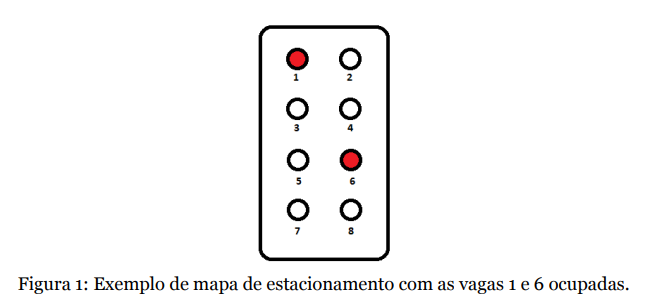
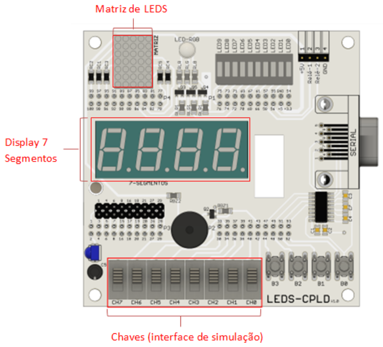
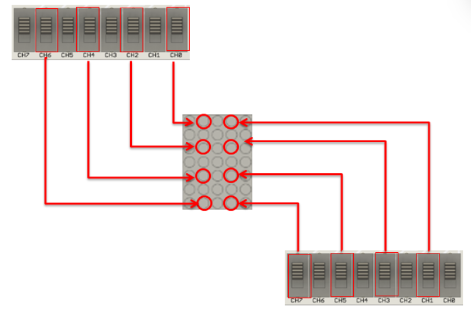
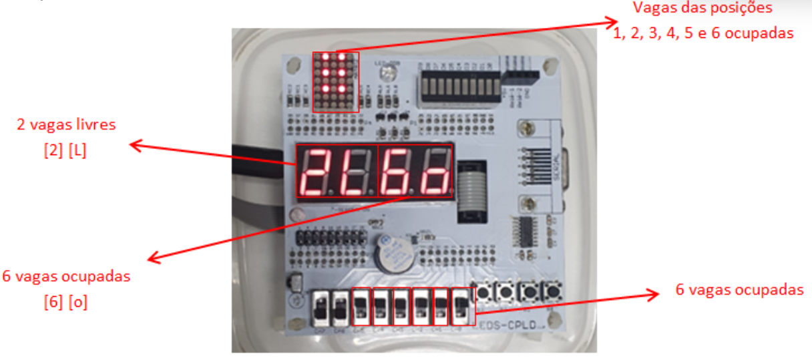

 
<h1 
    align="center"> 
    🅿️ 
      Sistema de gestão de vagas para estacionamento
</h1> 

# **Descrição do Projeto**

O Projeto demandado pelo componente curricular **TEC 498 MI - Projeto de Circuito Digitais**, utilizando 
a metodologia **Problem Based Learning (PBL**). Nesse sentido, o sistema foi projetado a partir da linguagem
de descrição verilog, possuindo o intuito de simular o  sistema de gestão de vagas para estacionamento. Essa simulação
acontecerá no Kit LEDS-CPLD, utilizando, principalmente, os conceitos e conteúdos referentes à máquina de estado.

# **Requisitos de Projeto**

* O protótipo deve conter uma interface de entrada para simular a ocupação e desocupação das 8 vagas do estacionamento;

* O protótipo deve conter uma interface para exibição da quantidade de vagas livres e das ocupadas, com distinção clara de qual valor representa cada tipo de vaga;

* O protótipo deve conter uma interface de exibição do mapa de vagas do estacionamento de acordo com a figura 1.

# **Demonstração da Aplicação**

A interface de simulação é feita inteiramente através da utilização das chaves presentes no kit LEDS-CPLD e os sinais resultantes, por sua vez, serão expostos na matriz de led e no display de 7 segmentos, também presentes no kit.

Cada chave estará relacionada com um led em uma determinada posição na matriz, totalizando a representação de 8 vagas de estacionamento. Portanto, a chave, ao ser acionada, mandará um sinal que acenderá um led da matriz indicando que aquela suposta vaga está ocupada. 

Funcionamento do protótipo para gestão de vagas de estacionamento com as primeiras 6 vagas ocupadas.

# **Tecnologias Utilizadas**

* Kit de desenvolvimento LEDS-CPLD, da família MAX II (modelo EPM240T100C5N);

* Linguagem de descrição de hardware Verilog;

* Projeto desenvolvido no ambiente Quartus II.

# **Pessoas Contribuidoras**

    Emanuel Antônio Lima Pereira
    Gabriel Sousa Sampaio
    Thiago Neri dos Santos Almeida

# **Referências**

    https://drive.google.com/file/d/132iacUp84EfLT1h1q_Fk5f3Js5hizhQA/view?usp=sharing

    Ronald J. Tocci, Neal S. Widmer, Gregory L. Moss. “Sistemas digitais : princípios e aplicações”; 
    revisão técnica Renato Giacomini ; 
    tradução Jorge Ritter. – 11ª edição – São Paulo : Pearson Prentice Hall, 2011;

    Ivan Valeije Idoeta, Francisco Gabriel Capuano. “Elementos de eletrônica digital”;
     – 40ª edição – São Paulo: Editora Érica ltda. ,2008.
